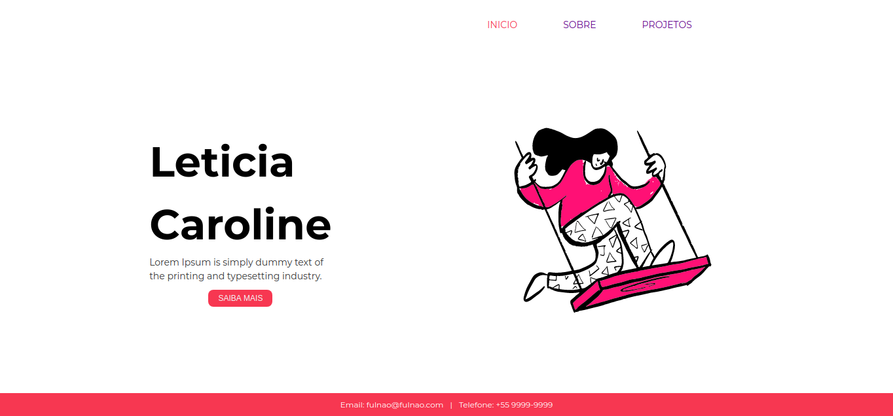

  

### :pencil2: Sobre o projeto
 Esse site foi criado para estudar conceitos básicos de HTML e CSS. Você pode ver o site online [aqui](https://levxyca.github.io/site-pessoal-portfolio/)

### :computer: Tecnologias utilizadas
- HTML
- CSS with Flexbox
-------------------------------------------------------

Feito com :hearts: por <a href="https://github.com/levxyca">Leticia Caroline Leonardo</a>
